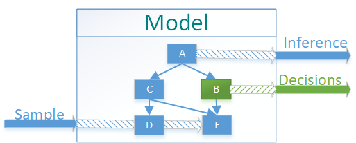

# EmbeddedAI    

*EmbededAI* is a library that provides elements of AI to C++ applications.
Due to small footprint it is usable even for small embedded systems.
Initial set of algorithms in this library is based on Bayesian approach to AI.
This library can dramatically simplify implementation of what otherwise 
would be complicated custom programming of hard to implement and maintain logic. 
With Bayesian approach the results are consistent with easily visualized model. 

# Methodology
  1. Build Model
  2. Apply sample/measurement
  3. Query model for inference of non-directly observed variables
  4. Query model for decisions based on maximum payoff/lowes loss


 
 

## Applications
   * Based on observations determine probabilities of any individual cause or 
 combination of causes 
   * Find the most likely explanations of any given observation (Minimum Probability of Error MPE)
   * Find most likely values of certain causes given observation (Maximum Aposteriori Probability MAP)
   * Find optimal sequence of decisions (actions) given costs (payoffs) 
     and observations performed prior to any action. 

Doxygen pages of Library Components can be viwed [here](https://rawgit.com/boralt/EmbeddedAI/master/api/html/classes.html)

## API

Project [Wiki](https://github.com/boralt/EmbeddedAI/wiki) contains brief API information. See doxygen pages [here](https://rawgit.com/boralt/EmbeddedAI/master/api/html/classes.html)


## Examples
Several test applications providing usage samples are available in ./tests 
directory and described in doxygen. Project wiki contains detailed walthrough
of sample implementations.


